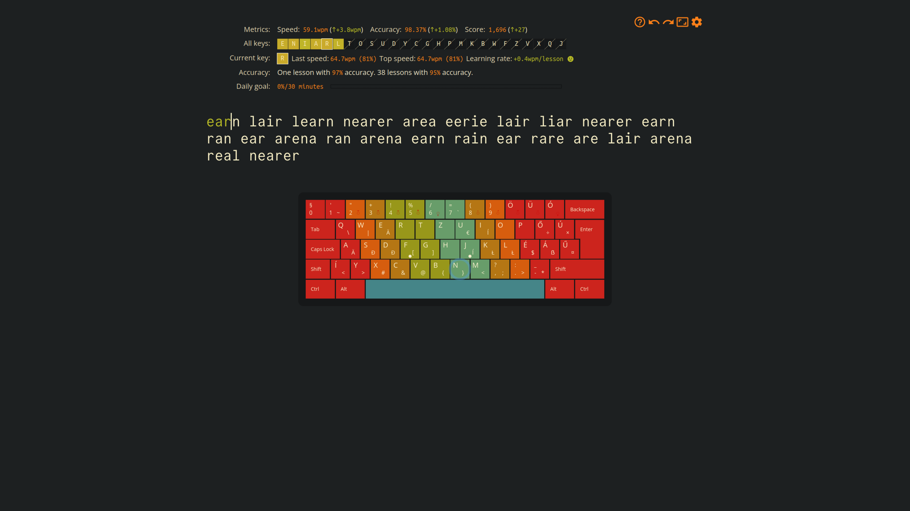

# keybr-gruvbox-dark

a gruvbox hard dark theme for keybr.com



## Installation

1. click the [theme switcher icon](https://github.com/user-attachments/assets/bb460285-b14e-4e91-a9c5-7ad9b1bb1ed2) under your profile
2. select `Custom...`
3. click on `Import`
4. select `gruvbox.keybr-theme`
5. enjoy!

## Modifications

if you dislike the website interface for modifying the theme, you can extract the `gruvbox.keybr-theme` file (it's just a zip!) and change the internal `theme.json` to your liking. don't forget to rearchive the file as a zip, and change the extension back to `.keybr-theme`.

for reference, this theme uses the following internal `theme.json`:

```json
{
    "--primary-d2": "rgb(13 15 16)",
    "--primary-d1": "rgb(22 24 25)",
    "--primary": "rgb(29 32 33)",
    "--primary-l1": "rgb(40 40 40)",
    "--primary-l2": "rgb(60 56 54)",
    "--secondary-d1": "rgb(249 234 183)",
    "--secondary": "rgb(251 241 207)",
    "--secondary-l1": "rgb(253 248 230)",
    "--secondary-l2": "rgb(255 255 254)",
    "--secondary-f1": "rgb(253 248 230)",
    "--secondary-f2": "rgb(255 255 254)",
    "--accent-d2": "rgb(214 93 14)",
    "--accent-d1": "rgb(175 58 3)",
    "--accent": "rgb(254 128 25)",
    "--accent-l1": "rgb(250 189 47)",
    "--accent-l2": "rgb(184 187 38)",
    "--error-d1": "rgb(204 36 29)",
    "--error": "rgb(251 73 52)",
    "--error-l1": "rgb(157 0 6)",
    "--textinput__color": "rgb(251 241 199)",
    "--textinput--special__color": "rgb(250 189 47)",
    "--textinput--hit__color": "rgb(184 187 38)",
    "--textinput--miss__color": "rgb(251 73 52)",
    "--slow-key-color": "rgb(251 73 52)",
    "--fast-key-color": "rgb(184 187 38)",
    "--effort-color": "rgb(131 165 152)",
    "--Name-color": "rgb(235 219 178)",
    "--Value-color": "rgb(254 128 25)",
    "--Value--more__color": "rgb(184 187 38)",
    "--Value--less__color": "rgb(251 73 52)",
    "--Chart-speed__color": "rgb(184 187 38)",
    "--Chart-accuracy__color": "rgb(250 189 47)",
    "--Chart-complexity__color": "rgb(211 134 155)",
    "--Chart-threshold__color": "rgb(142 192 124)",
    "--Chart-hist-h__color": "rgb(131 165 152)",
    "--Chart-hist-m__color": "rgb(251 73 52)",
    "--Chart-hist-r__color": "rgb(211 134 155)",
    "--pinky-zone-color": "rgb(204 36 29)",
    "--ring-zone-color": "rgb(214 93 14)",
    "--middle-zone-color": "rgb(181 118 20)",
    "--left-index-zone-color": "rgb(152 151 26)",
    "--right-index-zone-color": "rgb(104 157 106)",
    "--thumb-zone-color": "rgb(69 133 136)",
    "--syntax-keyword": "rgb(251 73 52)",
    "--syntax-string": "rgb(184 187 38)",
    "--syntax-number": "rgb(211 134 155)",
    "--syntax-comment": "rgb(146 131 116)"
}
```
